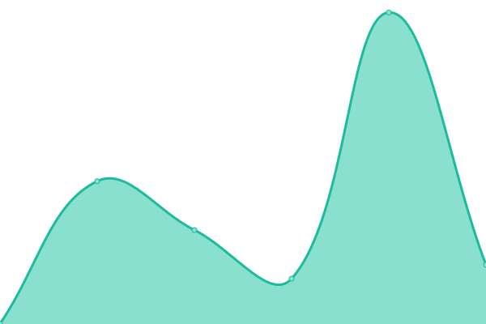
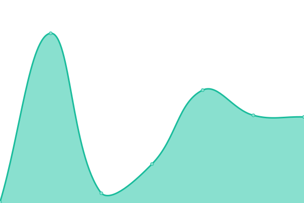

# [📈 Live Status](https://oeyoews.github.io/upptime): <!--live status--> **🟩 All systems operational**

With [Upptime](https://upptime.js.org), you can get your own unlimited and free uptime monitor and status page, powered entirely by a GitHub repository. We use [Issues](https://github.com/upptime/upptime/issues) as incident reports, [Actions](https://github.com/oeyoews/upptime/actions) as uptime monitors, and [Pages](https://https://oeyoew.fun) for the status page.

<!--start: status pages-->
<!-- This summary is generated by Upptime (https://github.com/upptime/upptime) -->
<!-- Do not edit this manually, your changes will be overwritten -->
<!-- prettier-ignore -->
| URL | Status | History | Response Time | Uptime |
| --- | ------ | ------- | ------------- | ------ |
|  [oeyoew-fun](https://oeyoew.fun) | 🟩 Up | [oeyoew-fun.yml](https://github.com/neotws/upptime/commits/HEAD/history/oeyoew-fun.yml) | 

 873ms
     
 | 

<a href="https://neotws.github.io/upptime/history/oeyoew-fun">100.00%</a>
    

|  [oeyoew-fun(bk)](https://oeyoews.github.io/tw5) | 🟩 Up | [oeyoew-fun-bk.yml](https://github.com/neotws/upptime/commits/HEAD/history/oeyoew-fun-bk.yml) | 

 406ms
     
 | 

<a href="https://neotws.github.io/upptime/history/oeyoew-fun-bk">100.00%</a>
    

|  [twm](https://twms.vercel.app) | 🟩 Up | [twm.yml](https://github.com/neotws/upptime/commits/HEAD/history/twm.yml) | 

 409ms
     
 | 

<a href="https://neotws.github.io/upptime/history/twm">100.00%</a>
    

|  [upptime](https://neotws.github.io/upptime) | 🟩 Up | [upptime.yml](https://github.com/neotws/upptime/commits/HEAD/history/upptime.yml) | 

 102ms
     
 | 

<a href="https://neotws.github.io/upptime/history/upptime">99.98%</a>
    

|  [neotw](https://neotw.tiddlyhost.com) | 🟩 Up | [neotw.yml](https://github.com/neotws/upptime/commits/HEAD/history/neotw.yml) | 

 1189ms
     
 | 

<a href="https://neotws.github.io/upptime/history/neotw">100.00%</a>
    

<!--end: status pages-->

[**Visit our status website →**](https://oeyoews.github.io/upptime/)

<!-- ## 📄 License

- Powered by: [Upptime](https://github.com/upptime/upptime)
- Code: [MIT](./LICENSE) © [Upptime](https://upptime.js.org)
- Data in the `./history` directory: [Open Database License](https://opendatacommons.org/licenses/odbl/1-0/) -->
